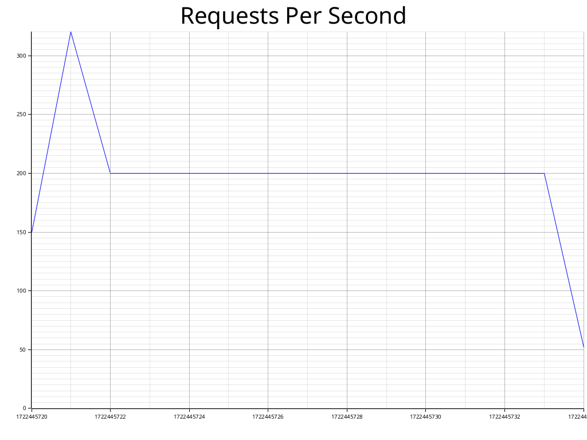
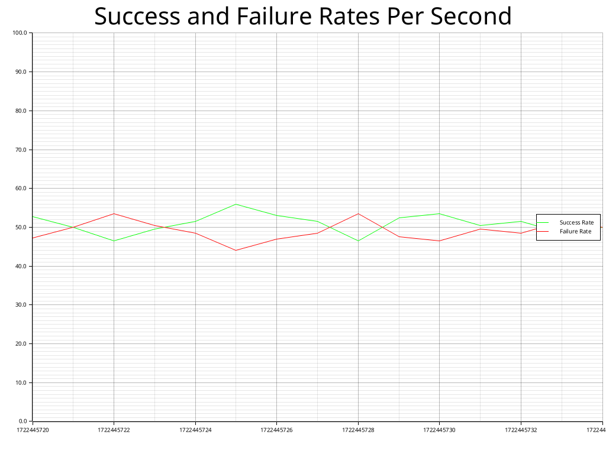

## yalt-gen-report

`yalt-gen-report` is a Rust-based command-line tool designed to generate reports from a database of metrics. This tool plots various metrics and saves the results as image files. It uses the `plotters` crate for creating the plots and the `chrono` crate for handling date and time formatting.

### Features

- Plot and save charts for metrics like requests per second and success/failure rates.
- Format timestamps to human-readable dates and times on the X-axis.
- Customize chart appearance with titles and labels.

### Prerequisites

Before you begin, ensure you have met the following requirements:

- You have installed Rust and Cargo. You can install Rust from [rust-lang.org](https://www.rust-lang.org/).
- You have a database file containing the metrics to be plotted.

### Installation

1. Clone the repository:

    ```sh
    git clone https://github.com/yourusername/yalt-gen-report.git
    ```

2. Change into the project directory:

    ```sh
    cd yalt-gen-report
    ```

3. Build the project:

    ```sh
    cargo build --release
    ```

### Usage

To use `yalt-gen-report`, run the following command:

```sh
./target/release/yalt-gen-report --database /path/to/your/database.db
```

Replace `/path/to/your/database.db` with the path to your database file.

### Example

Assuming you have a database file located at `./databases/metrics.db`, you can generate the report by running:

```sh
./target/release/yalt-gen-report --database ./databases/metrics.db
```

This will create two PNG files in the current directory:

- `requests_per_second.png`: Shows the number of requests per second.
- `success_failure_rates.png`: Displays the success and failure rates per second.

### Output

The output consists of two PNG files with plots:

1. **Requests Per Second**

    

    - **X-Axis**: Human-readable timestamps.
    - **Y-Axis**: Number of requests.
    - **Line Color**: Blue.

2. **Success and Failure Rates Per Second**

    

    - **X-Axis**: Human-readable timestamps.
    - **Y-Axis**: Percentage rates.
    - **Line Colors**: Green for success rates, Red for failure rates.

### Contributing

To contribute to `yalt-gen-report`, follow these steps:

1. Fork this repository.
2. Create a branch: `git checkout -b feature-branch-name`.
3. Make your changes and commit them: `git commit -m 'Add some feature'`.
4. Push to the original branch: `git push origin feature-branch-name`.
5. Create the pull request.

Alternatively, see the GitHub documentation on [creating a pull request](https://help.github.com/articles/creating-a-pull-request).

### Acknowledgements

- [Plotters](https://github.com/38/plotters) for the awesome plotting library.
- [Chrono](https://github.com/chronotope/chrono) for the date and time handling library.
